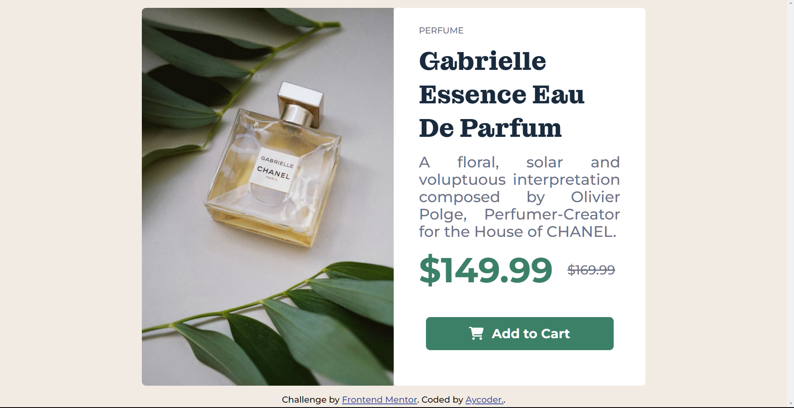

# Frontend Mentor - Product preview card component solution

This is a solution to the [Product preview card component challenge on Frontend Mentor](https://www.frontendmentor.io/challenges/product-preview-card-component-GO7UmttRfa). Frontend Mentor challenges help you improve your coding skills by building realistic projects. 

## Table of contents

- [Frontend Mentor - Product preview card component solution](#frontend-mentor---product-preview-card-component-solution)
  - [Table of contents](#table-of-contents)
  - [Overview](#overview)
    - [The challenge](#the-challenge)
    - [Screenshot](#screenshot)
    - [Links](#links)
    - [Built with](#built-with)
    - [What I learned](#what-i-learned)
    - [Continued development](#continued-development)
    - [Useful resources](#useful-resources)
  - [Author](#author)
  - [Acknowledgments](#acknowledgments)

## Overview

### The challenge

Users should be able to:

- View the optimal layout depending on their device's screen size
- See hover and focus states for interactive elements

### Screenshot

### Links

- Solution URL: [https://www.frontendmentor.io/solutions/responsive-landing-page-for-a-product-preview-component-using-css-grid-BHv7hra08H]
- Live Site URL: [https://product-preview-card-component-main-one-omega.vercel.app/)]

### Built with

- Semantic HTML5 markup
- CSS custom properties
- Flexbox
- CSS Grid
- Mobile-first workflow

### What I learned

When designing the product preview component using HTML and CSS, I learned how to structure the HTML markup to represent the various elements of the product preview, such as images, descriptions, and buttons. Additionally, I gained insights into styling techniques, including the use of CSS for layout, color schemes, and typography, to create an aesthetically pleasing and user-friendly product preview. This experience enhanced my understanding of responsive design principles, enabling me to ensure a consistent and visually appealing presentation across different devices and screen sizes.

### Continued development

I would like to continue to develop my skills in responsive design, including the use of CSS Grid and Flexbox, to create more complex layouts. Additionally, I would like to learn more about the use of JavaScript to add interactivity to web pages.

### Useful resources

- [CSS Grid](https://css-tricks.com/snippets/css/complete-guide-grid/) - This article provides a comprehensive overview of CSS Grid, including the use of grid properties to create responsive layouts.

## Author

- Website - [Ayomide Olisa](https://mywebportfolio-github-io.vercel.app/)

## Acknowledgments

I would like to thank Frontend Mentor for providing the opportunity to practice my HTML and CSS skills by completing the product preview card component challenge. Additionally, I would like to thank the Frontend Mentor community for providing feedback on my solution, which enabled me to improve my skills and understanding of HTML and CSS.
